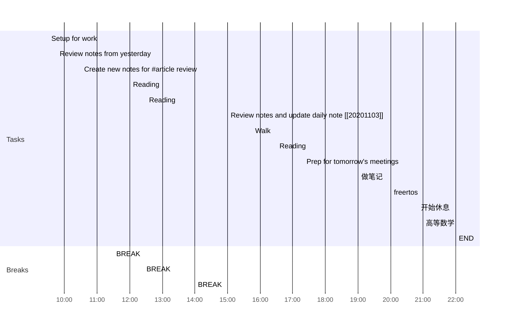

## Day Planner

This is my plan for the day broken into 3 main sections:
1. Morning Prep
2. Reading
3. Afternoon Review

### 早间计划

This is where I get ready for work and do my usual prep.

- [x] 09:30 Setup for work
- [x] 09:45 Review notes from yesterday
- [x] 10:30 Create new notes for #article review
- [x] 11:30 BREAK

### 阅读计划

A section of the day dedicated to reading:

1. Articles.
2. Book chapters assigned for the day.
3. Re-reading past notes.
   
- [x] 12:00 Reading
  - [ ] Article 1
  - [ ] Article 2
  - [ ] Article notes review
- [x] 12:25 BREAK
- [x] 12:30 Reading
- [x] 14:00 BREAK

### 下午计划

I use this time to review what I have done earlier in the day and complete any tasks to prepare for the next day.

- [x] 15:00 Review notes and update daily note [[20201103]]
- [x] 15:45 Walk
- [x] 16:30 Reading
- [x] 17:20 Prep for tomorrow's meetings

### 晚间计划
- [x] 19:00 做笔记
- [x] 20:00 freertos
- [x] 20:50 开始休息
- [x] 21:00 高等数学

- [ ] 22:00 END