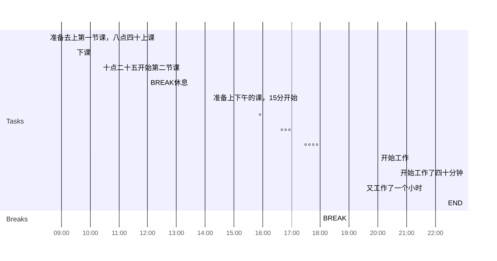

## 全天计划
以下是我今天的计划，主要分为三个部分:
1. 上午的计划
2. 下午的计划
3. 晚上的计划
4. 总结时间到
5. 每天的计划比如锻炼和英语
6. 阅读计划

### 上午的计划

和往常一样上课

- [x] 08:30 准备去上第一节课，八点四十上课
- [x] 09:25 下课
- [x] 10:20 十点二十五开始第二节课
- [ ] 做笔记
- [ ] 写代码
- [ ] 看视频
- [x] 12:00 BREAK休息

### 下午的计划

利用这段时间回顾一下当天早些时候已经完成的工作，并为第二天做好准备。

- [x] 14:10 准备上下午的课，15分开始

- [ ] 15:45 。
- [ ] 16:30 。。。
- [ ] 17:20 。。。。
- [ ] 18:00 BREAK
我利用这段时间回顾当天早些时候做过的事情，完成第二天的任务。

### 晚上的计划
- [ ] 20:00 开始工作
			//八点整，整整休息了半个小时
- [ ] 20:40 开始工作了四十分钟
- [ ] 21:40 又工作了一个小时
### 总结时间到
- [ ] 22:00回顾这一天
我利用这段时间回顾当天早些时候做过的事情，完成第二天的任务。利用这段时间回顾一下当天早些时候已经完成的工作，并为第二天做好准备。
- [ ] 22:20 END