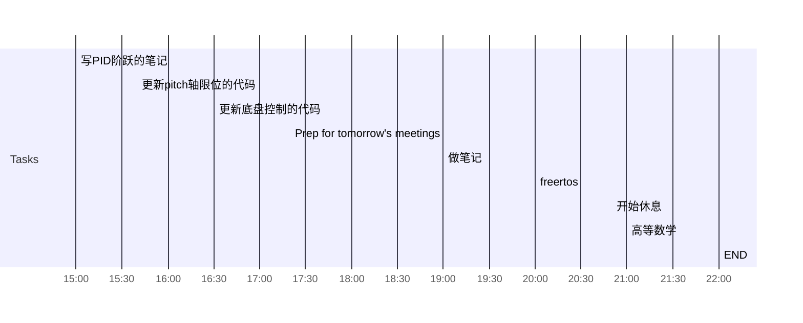

## Day Planner

### 下午计划

- [ ] 15:00 写PID阶跃的笔记
- [ ] 15:40 更新pitch轴限位的代码
- [ ] 16:30 更新底盘控制的代码
- [ ] 17:20 Prep for tomorrow's meetings

### 晚间计划
- [ ] 19:00 做笔记
- [ ] 20:00 freertos
- [ ] 20:50 开始休息
- [ ] 21:00 高等数学

- [ ] 22:00 END